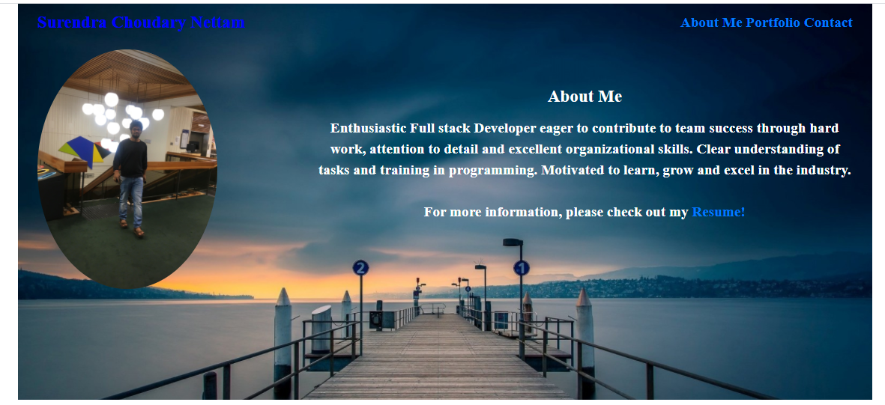
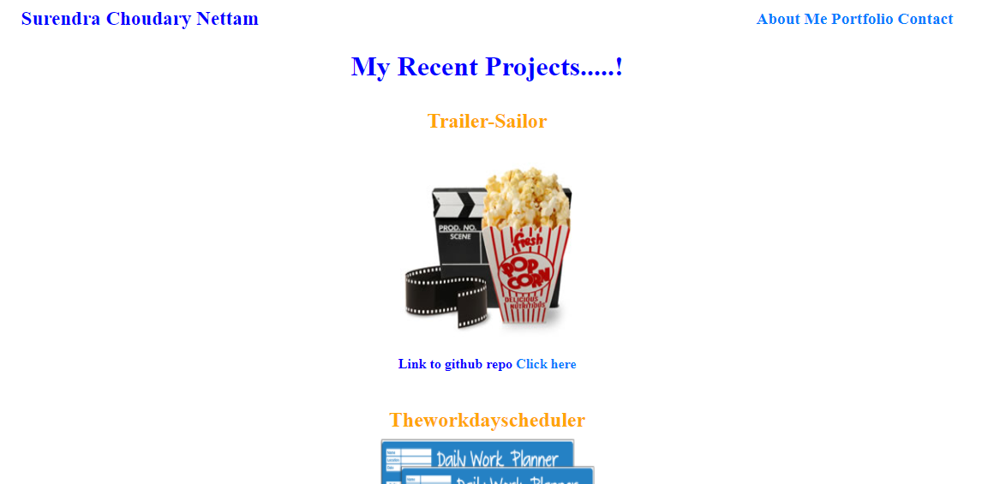
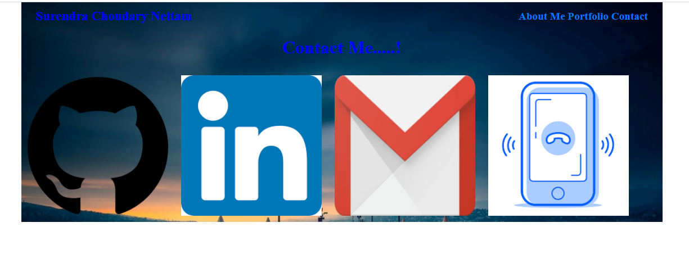
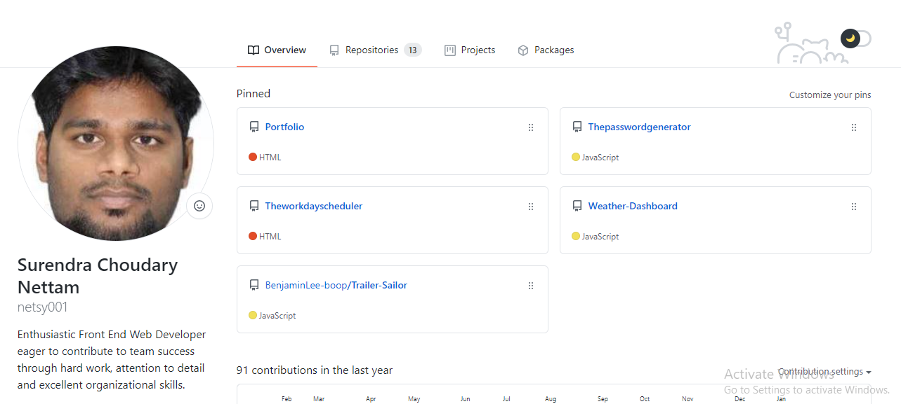
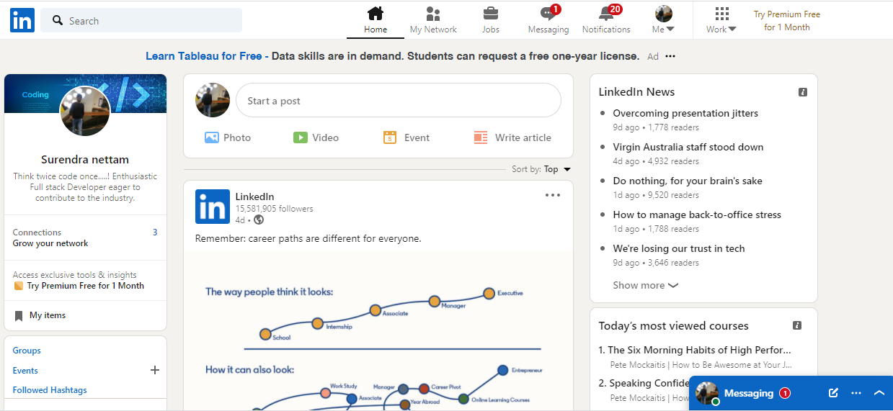
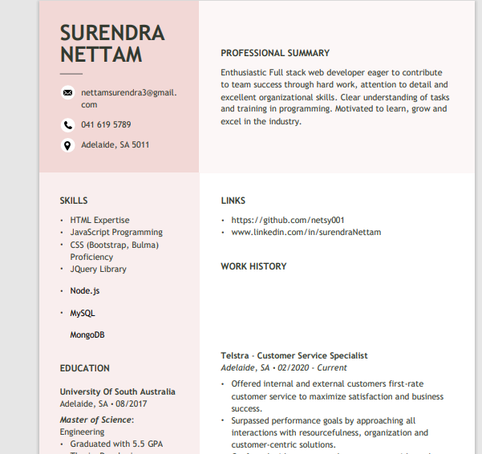

# PortfolioApp

# Portfolio

[Introduction](#Introduction)

[Prerequisites](#Prerequisites)

[Installation](#Installation)

[Summary](#Summary)

[Psuedo code](#Psuedo-code)

[Author](#Author)

## Introduction

Portfolio: AS part of the program this assignment is to update the portfolio to be employer competitive. Updating the recent projects github links into the portfolio page, contact information, and some of the links to the home works done using the knowledge we have gained during the period of time.

## Prerequisites
To program and write code you need a text editor. Visual Studio Code is the best option to choose.

This assignment project has been delpoyed to Githubpages. To use this project, project link [Link to Github](https://github.com/netsy001/Portfolio)

## Installation

To install the code you can clone it at github repository using github guidelines.

## Summary

This project includes four files:- 

`index.html` 

`portfolio.html`

`contact.html`

`style.css`

`README.md`

`assets`

These files include all the code and information of this assignment project and the screenshot images of the responsive are included in assets.

## Psuedo code
### HTML

1. This assignment is done using HTML. 
2. anchor ```` used to link the pages, get the images and files which are stored in the assets folder.
3. This assignment all the images, updated resume are saved in the assets folder.
4. This application is 100% Responsive.

## Screen shots.
Updated Portfolio:
 

Execution: Open in browser

## Author
Surendra Choudary Nettam
